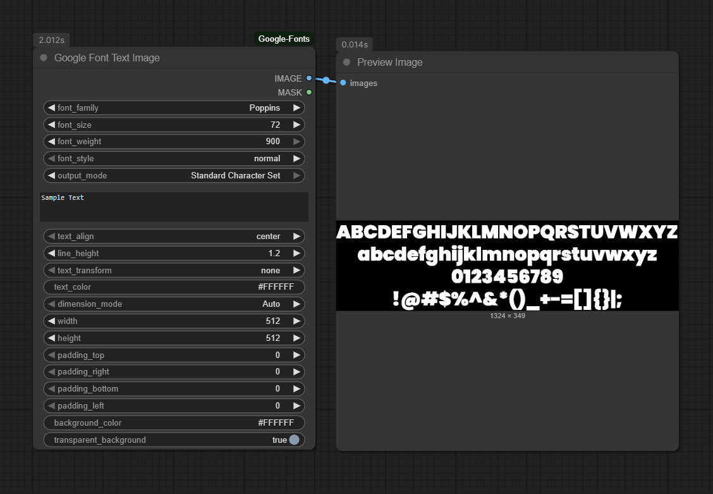

# Google Font Text Image Node for ComfyUI

[](https://opensource.org/licenses/MIT)
[](https://www.python.org/downloads/release/python-3120/)

> Dynamically generate text-based images using the entire Google Fonts library directly in your ComfyUI workflows.

This custom node provides a powerful and flexible way to create images from text with advanced typographic controls. It's an ideal tool for generating inputs for Typography, creating titles and watermarks, or producing font specimens for multimodal models to analyze and generate.



Click below to see the video example:
<br/>
<p align="center">
  <a href="https://www.youtube.com/watch?v=KA2Uxha0GsQ" target="_blank">
    
  </a>
</p>

---

## Features

-   **Full Google Fonts Library:** Access and use any of the 1,500+ fonts available on Google Fonts, loaded dynamically.
-   **Advanced Typographic Control:** Adjust font size, weight, style (normal/italic), text alignment, line height, and text transformation (uppercase, lowercase, etc.).
-   **Dual Output Modes:**
    -   **Custom Text:** Render any text you input, respecting line breaks (`\n`).
    -   **Standard Character Set:** Generate a font specimen image (A-Z, a-z, 0-9, symbols) to capture the font's overall style as reference for multimodal models.
-   **Automatic Dimension Calculation:** Set width or height to -1 to automatically size the image based on text content (requires Playwright).
-   **Text Wrapping:** Text automatically wraps within specified dimensions when using fixed width/height values.
-   **Individual Padding Controls:** Fine-tune text positioning with independent controls for top, right, bottom, and left padding.
-   **Transparent Background:** Output a clean RGB image and a corresponding alpha mask, perfect for compositing and layering.
-   **Dynamic Font Variant Validation:** The node intelligently checks if a selected font weight/style is available and provides a graceful fallback if it isn't.

## Installation

1.  **Navigate to your ComfyUI custom nodes directory:**
    ```bash
    cd ComfyUI/custom_nodes/
    ```

2.  **Clone the repository:**
    ```bash
    git clone https://github.com/ru4ls/ComfyUI_Google-Font.git
    ```
    *(Alternatively, you can download the repository as a ZIP and extract it into your `custom_nodes` folder.)*

3.  **Install the required dependencies:**
    Open a terminal/command prompt, activate your ComfyUI virtual environment (venv), and run:
    ```bash
    pip install -r ComfyUI_Google-Font/requirements.txt
    ```

4.  **Install Playwright browser binaries:**
    Run the following command to install the necessary browser binaries for Playwright:
    ```bash
    playwright install
    ```
    *(Note: You may need to run this in your activated virtual environment)*

5.  **Restart ComfyUI:**
    You must completely restart ComfyUI for the node to be loaded.

## Google Fonts API Key (Recommended)

While the node can often fetch the font list without an API key, it is highly recommended to use one to avoid potential rate limits and ensure stability.

1.  **Get a free API key** from the [Google Cloud Console](https://developers.google.com/fonts/docs/developer_api#APIKey).
2.  In your `ComfyUI/custom_nodes/ComfyUI_GoogleFontNode/` folder, you will find a file named `.env.example`.
3.  **Rename** this file to **`.env`**.
4.  Open the `.env` file and paste your API key into it:
    ```
    GOOGLE_FONTS_API_KEY="YOUR_API_KEY_HERE"
    ```

The node will automatically detect and use this key on the next restart.

## How to Use

1.  After restarting ComfyUI, you can add the node by right-clicking on the canvas and selecting:
    `Add Node` -> `Ru4ls/Google Fonts` -> `Google Font Text Image`

2.  Connect the outputs to other nodes. For example, connect the `IMAGE` output to a `Preview Image` node to see the result or connect it to other nodes for further processing.

### Node Inputs

| Input                    | Description                                                                                                                              |
| ------------------------ | ---------------------------------------------------------------------------------------------------------------------------------------- |
| `font_family`            | A dropdown list of all available Google Fonts.                                                                                           |
| `output_mode`            | - **Custom Text:** Renders the text from the `text` input box.<br>- **Standard Character Set:** Renders a predefined set of characters.      |
| `text`                   | The text you want to display. Supports multiple lines. Ignored if `output_mode` is "Standard Character Set".                               |
| `dimension_mode`         | Choose between "Auto" (automatic sizing based on text content) or "Define Manually" (fixed width/height).                                  |
| `width` / `height`       | The dimensions of the output image in pixels (64-8192). Only used when `dimension_mode` is "Define Manually".                               |
| `font_size`              | The size of the font in points.                                                                                                          |
| `font_weight`            | The thickness of the font (e.g., `100` for Thin, `400`/`regular` for Normal, `700` for Bold).                                              |
| `font_style`             | Choose between `normal` and `italic`.                                                                                                    |
| `text_align`             | Horizontal alignment of the text: `center`, `left`, or `right`.                                                                          |
| `line_height`            | The vertical spacing between lines of text. `1.0` is single spacing, `2.0` is double spacing.                                            |
| `text_transform`         | Force the text case: `none`, `uppercase`, `lowercase`, or `capitalize`.                                                                  |
| `text_color`             | The color of the text in hex format (e.g., `#000000` for black). Use with an external color picker node.                                   |
| `background_color`       | The color of the background in hex format (e.g., `#FFFFFF` for white). Ignored if `transparent_background` is checked.                      |
| `transparent_background` | **(Recommended)** If checked, the background will be transparent, and the `MASK` output will contain the text's shape.                      |
| `padding_top`            | Top padding in pixels (0-200). Controls the space between text and the top edge.                                                          |
| `padding_right`          | Right padding in pixels (0-200). Controls the space between text and the right edge.                                                      |
| `padding_bottom`         | Bottom padding in pixels (0-200). Controls the space between text and the bottom edge.                                                     |
| `padding_left`           | Left padding in pixels (0-200). Controls the space between text and the left edge.                                                         |

### Node Outputs

| Output  | Description                                                                                             |
| ------- | ------------------------------------------------------------------------------------------------------- |
| `IMAGE` | The generated text image in RGB format.                                                                 |
| `MASK`  | A grayscale mask of the text. If `transparent_background` is used, this is the alpha channel.             |

## Example Workflow

A powerful use case is to layer the generated text over another image.

1.  Use a **Color Picker Node** (from ComfyUI LayerStyle) and connect its string output to the `text_color` input of the Google Font Node.
2.  Set `transparent_background` to **True**.
3.  Load a base image using a `Load Image` node.
4.  Use a `Composite` or `Layer Style` node to combine the base image with the `IMAGE` and `MASK` from the Google Font Node.

## Troubleshooting

#### **Help! My text is getting cut off (truncated)!**

This issue has been significantly improved with the Playwright migration. You now have two solutions:

**Solution 1: Use Auto-Sizing**
1.  Set `dimension_mode` to **Auto** for automatic sizing based on text content.

**Solution 2: Manual Adjustments**
1.  **Decrease** the `font_size`.
2.  **Increase** the `width` or `height` of the image when in "Define Manually" mode.
3.  **Increase** the `padding` values to provide more space around the text.
4.  **Decrease** the `line_height` if you have multiple lines of text.

#### **Playwright Browser Not Found Error**

If you get a browser not found error after installation:
1.  Run `playwright install` in your terminal/command prompt to install browser binaries.
2.  Make sure to activate your virtual environment before running the command.

#### **The node doesn't appear in ComfyUI after installation.**

1.  Make sure you have correctly installed the dependencies from `requirements.txt`.
2.  Ensure you have fully restarted the ComfyUI server.

#### **The font list is empty or very small.**

This can happen if the node fails to connect to the Google Fonts API.
1.  Check your internet connection.
2.  Make sure you have a valid API key in your `.env` file for the most reliable connection.

## License

This project is licensed under the MIT License - see the [LICENSE](LICENSE) file for details.

## Changelog

See the [CHANGELOG](CHANGELOG.md) file for a complete history of changes.